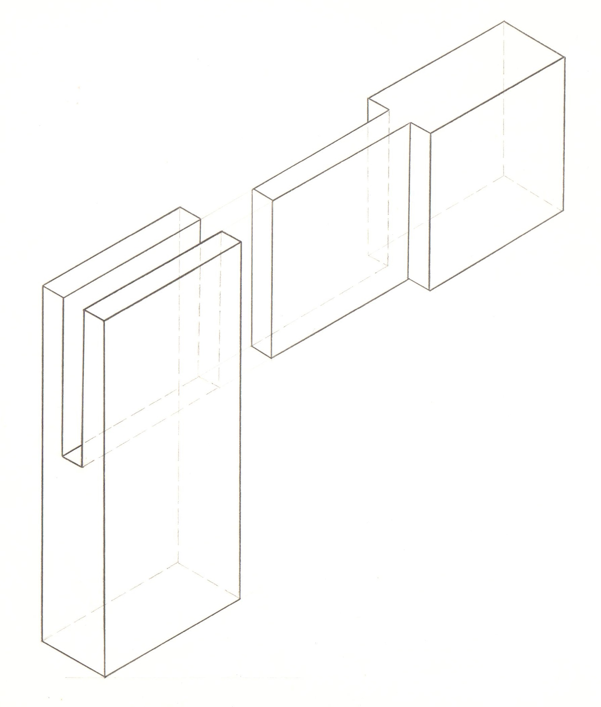
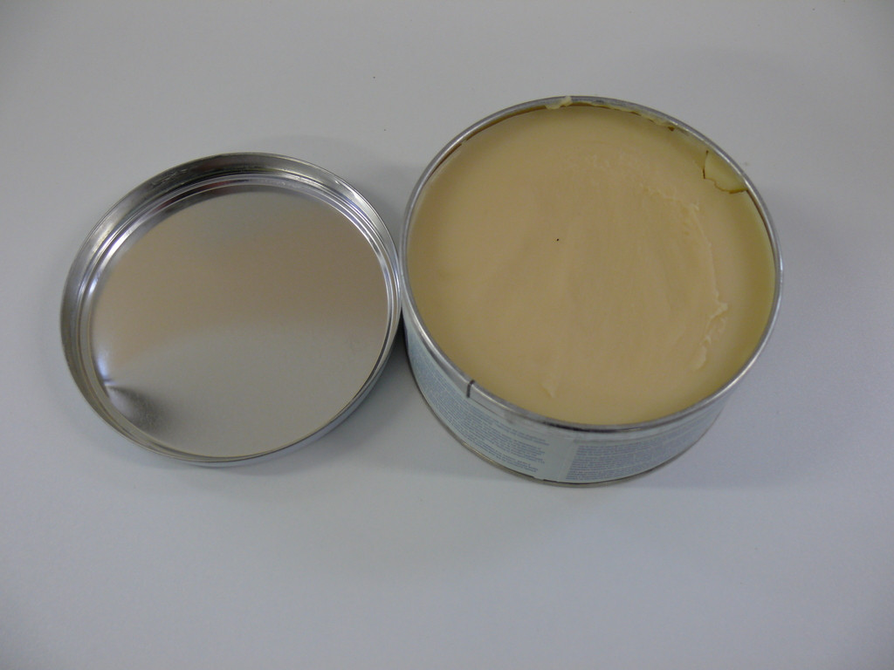

<!--
author:    Hilke Domsch; Florian Riefling
email:     hilke.domsch@gkz-ev.de
date:      2026-01-05
version:   0.1.12

narrator:  Deutsch Male
language:  de

edit:      https://liascript.github.io/LiveEditor/?/github/Ifi-DiAgnostiK-Project/raumausstattung-polstergestelle

icon:      https://ifi-diagnostik-project.github.io/assets/img/Logo_234px.png
logo:      assets/images/armrest_pixabay.jpg

attribute: https://pixabay.com/de/photos/armlehne-sessel-polsterer-stoff-647300/

comment:   Holzverarbeitung im Raumausstatter-Handwerk (Polsterei)

link:      style.css

import:    https://raw.githubusercontent.com/Ifi-DiAgnostiK-Project/LiaScript_DragAndDrop_Template/refs/heads/main/README.md
           https://raw.githubusercontent.com/Ifi-DiAgnostiK-Project/LiaScript_ImageQuiz/refs/heads/main/README.md
           https://raw.githubusercontent.com/Ifi-DiAgnostiK-Project/Piktogramme/refs/heads/main/makros.md
           https://raw.githubusercontent.com/Ifi-DiAgnostiK-Project/Holzarten/refs/heads/main/makros.md
           https://raw.githubusercontent.com/Ifi-DiAgnostiK-Project/Bildersammlung/refs/heads/main/makros.md
           https://raw.githubusercontent.com/Ifi-DiAgnostiK-Project/Textilpflegesymbole/refs/heads/main/makros.md

title:     R3/06 Konstruktive Holzgestelle beim Bau von Polstermöbeln

tags:      Raumausstatter,
           Polsterei,
           Handwerk,
           Polstergestelle,
           Holzgestelle,
           Werkstoffe Polstermöbel

@style
.emphasis {
        font-weight: bolder;
        font-size: 12pt;
}
.green {
        color: green;
}
.redbold {
    color: red;
    font-weight: bolder;
}
@end
-->

# Holzgestelle als Baugerüst für Polstermöbel  🪑

Holzgestelle bilden die tragende Grundlage vieler gepolsteter Möbel.   Sie beeinflussen sowohl Stabilität<!-- class="emphasis green"-->, Funktion<!-- class="emphasis green"--> als auch die spätere Gestaltung<!-- class="emphasis green"--> eines Möbelstücks maßgeblich.

Sie haben sich während Ihrer fachpraktischen Ausbildung grundlegende Kenntnisse zum Aufbau und zur Konstruktion von Holzgestellen im Raumausstatter-Handwerk angeeignet.

Die nachfolgenden Fragen dienen der Überprüfung Ihres erworbenen Fachwissens zu:

<!-- class="book"-->
- Unterscheidung verschiedener Gestellarten
- Auswahl geeigneter Holzarten
- Aufbau von Vollholzgestellen
- eingesetzten Holzverbindungen

 

<!-- class="emphasis"-->Bitte beachten Sie, dass mehrere Antworten richtig sein können.

<!-- class="highlight" -->
Wir wünschen Ihnen viel Erfolg beim Beantworten der Fragen!

   

")<!-- style="max-width: 550px; width: 100%" -->

## Arten von Holzgestellen

<section class="flex-container border">

<!-- class="highlight"-->
Ziehen Sie den richtigen Begriff in das Antwortfeld.

<!--
data-randomize
data-max-trials="3"
data-solution-button="off"
data-show-partial-solution
-->
Holzgestelle bestehen aus [->[  (mehreren Holzteilen) | einem Holzteil ]].

</section>

<section class="flex-container border">

<!-- class="highlight"-->
Welche Arten von Holzgestellen werden im Raumausstatter-Handwerk unterschieden?\
Wählen Sie alle richtigen Begriffe aus.

<!-- class="redbold"-->
> Es sind insgesamt vier Antworten richtig!

<!--
data-randomize
data-max-trials="3"
data-solution-button="off"
-->
@dragdropmultiple(@uid,Vollholzgestell|Massivholzgestell|Blindholzgestell|Sichtholzgestell,Metall-Holz-Verbundgestell|Kunststoffgestell)

</section>

## Typische Holzarten für Polstergestelle

<section class="flex-container border">

<!-- class="highlight"-->
Welche Holzarten und Holzverbundarten werden typischerweise für ~~Blindholzgestelle~~ verwendet?

<!-- class="redbold"-->
> Es sind insgesamt vier Antworten richtig!

<!-- data-randomize -->
- [[X]] Buche
- [[X]] Holzspanplatte
- [[X]] Sperrholz
- [[X]] Holzfaserplatte
- [[ ]] Eiche
- [[ ]] Esche
- [[ ]] Kirsche

")<!-- style="max-width: 350px; width: 100%; margin-left: 30px; margin-top:100px;" -->

</section>

<section class="flex-container border">

<!-- class="highlight"-->
Welche Holzarten werden typischerweise für ~~Vollholzgestelle~~ verwendet?

<!-- class="redbold"-->
> Es sind insgesamt fünf Antworten richtig!

<!-- data-randomize -->
- [[X]] Buche
- [[X]] Eiche
- [[X]] Esche
- [[X]] Kirsche
- [[X]] Birke
- [[ ]] Sperrholz
- [[ ]] Leimholz
- [[ ]] OSB-Platte

")<!-- style="max-width: 350px; width: 100%; margin-left: 30px; margin-top:100px;" -->

</section>

## Aufbau von Vollholzgestellen

<section class="flex-container border">

<!-- class="highlight" style="margin-bottom:40px;"-->
Aus welchen Gestellteilen besteht ein Vollholzgestell?

<!-- class="redbold"-->
> Es sind insgesamt drei Antworten richtig!

<!-- data-randomize -->
- [[X]] Zargenanlage
- [[X]] Armlehnen
- [[X]] Rückenlehne
- [[ ]] Schaumstoffträger
- [[ ]] Sitzfläche
- [[ ]] Rückenpolster

")<!-- style="max-width: 250px; width: 100%; margin-left: 30px; margin-top:100px;" -->

</section>

<section class="flex-container border">

<!-- class="highlight" style="margin-bottom:40px;"-->
Aus welchen Gestellteilen besteht ein Vollholzgestell?\
Ordnen Sie den Zahlen 1 - 8 im Bild den jeweils richtigen Fachbegriff zu.

<ol class="styled-list">
<!--
data-randomize
data-max-trials="3"
data-solution-button="off"
data-show-partial-solution
-->
<li> [[ (Vorderschwinge/-zarge) | Hinterschwinge/-zarge   | Seitenschwinge/-zarge  |  Füße |  Armlehnstütze/Vorderstollen |  Armlehnbrett/Armlehnfederbrett  |  Backenhölzer | Kopfleiste ]]</li>
<li> [[ Vorderschwinge/-zarge | (Hinterschwinge/-zarge)   | Seitenschwinge/-zarge  |  Füße |  Armlehnstütze/Vorderstollen |  Armlehnbrett/Armlehnfederbrett  |  Backenhölzer | Kopfleiste  ]]</li>
<li> [[ Vorderschwinge/-zarge | Hinterschwinge/-zarge   | (Seitenschwinge/-zarge)  |  Füße |  Armlehnstütze/Vorderstollen |  Armlehnbrett/Armlehnfederbrett  |  Backenhölzer | Kopfleiste ]]</li>
<li> [[ Vorderschwinge/-zarge | Hinterschwinge/-zarge   | Seitenschwinge/-zarge  |  (Füße) |  Armlehnstütze/Vorderstollen |  Armlehnbrett/Armlehnfederbrett  |  Backenhölzer | Kopfleiste ]]</li>
<li> [[ Vorderschwinge/-zarge | Hinterschwinge/-zarge   | Seitenschwinge/-zarge  |  Füße |  (Armlehnstütze/Vorderstollen) |  Armlehnbrett/Armlehnfederbrett  |  Backenhölzer | Kopfleiste  ]]</li>
<li> [[ Vorderschwinge/-zarge | Hinterschwinge/-zarge   | Seitenschwinge/-zarge  |  Füße |  Armlehnstütze/Vorderstollen |  (Armlehnbrett/Armlehnfederbrett)  |  Backenhölzer | Kopfleiste  ]]</li>
<li> [[ Vorderschwinge/-zarge | Hinterschwinge/-zarge   | Seitenschwinge/-zarge  |  Füße |  Armlehnstütze/Vorderstollen |  Armlehnbrett/Armlehnfederbrett  |  (Backenhölzer) | Kopfleiste ]]</li>
<li> [[ Vorderschwinge/-zarge | Hinterschwinge/-zarge   | Seitenschwinge/-zarge  |  Füße |  Armlehnstütze/Vorderstollen |  Armlehnbrett/Armlehnfederbrett  |  Backenhölzer | (Kopfleiste) ]]</li>
</ol>

")<!-- style="max-width: 550px; width: 100%; margin-left:-30px; margin-top:-20px;" -->

</section>

### Typische Holzverbindungen

<section class="flex-container border">

<!-- class="highlight"-->
Ziehen Sie den richtigen Begriff in das Antwortfeld.

<!--
data-randomize
data-max-trials="3"
data-solution-button="off"
data-show-partial-solution
-->
Eine der typischen Holzverbindungen im Polstergestellbau ist die [->[  (verleimte Dübelung) | Steckverbindung ]].

</section>

<section class="flex-container border">

<!-- class="highlight" style="margin-bottom:40px;"-->
Welche Verbindungen können beim Polstergestellbau zum Einsatz kommen?

<!-- class="redbold"-->
> Es sind insgesamt fünf Antworten richtig!

<!-- data-randomize -->
- [[X]] Schlitz-Zapfen-Verbindung
- [[X]] Dübelverbindung
- [[X]] gezinkte Verbindung
- [[X]] Überblattung
- [[ ]] Nut-Blatt-Verbindung
- [[ ]] Federsperrverbindung
- [[ ]] Falzkniffverbindung
- [[X]] Schraubverbindung

<!-- style="max-width: 250px; width: 100%; margin-left: 30px; margin-top:20px;" -->

</section>

## Blindholzgestelle

<section class="flex-container border">

<!-- class="highlight"-->
Ziehen Sie den richtigen Begriff in das Antwortfeld.

<!--
data-randomize
data-max-trials="3"
data-solution-button="off"
-->
Bei Blindholzgestellen werden alle Gestellteile [->[  (überpolstert bzw. bezogen) | holzsichtig gelassen ]].

</section>

<section class="flex-container border">

<!-- class="highlight"-->
Welche Holzarten und Holzverbundarten werden typischerweise für ~~Blindholzgestelle~~ verwendet?

<!-- class="redbold"-->
> Es sind insgesamt vier Antworten richtig!

<!-- data-randomize -->
- [[X]] Buche
- [[X]] Holzspanplatte
- [[X]] Sperrholz
- [[X]] Holzfaserplatte
- [[ ]] Eiche
- [[ ]] Esche
- [[ ]] Kirsche

@Hoelzer1.Buche(40)<!-- style="max-width: 250px; width: 100%; margin-left: 40px; margin-top:50px;" -->\
"Holzbild" Buche; _Quelle: Florian Riefling, HWK Dresden_

</section>

## Unterschiede Blindholz- und Sichtholzgestelle

<section class="flex-container border">

<!-- class="highlight" style="margin-bottom:40px;"-->
Welche Aussagen zu Blind- und Sichtholzgestellen sind richtig?

<!-- class="redbold"-->
> Es stimmen vier Antworten!

<!-- data-randomize -->
- [[X]] Blindholzgestelle sind vollständig verdeckt und überpolstert.
- [[X]] Sichtholzgestelle bleiben sichtbar und sind gestalterisches Element.
- [[X]] Sichtholzgestelle erfordern eine saubere Verarbeitung.
- [[ ]] Blindholzgestelle müssen keine hohe Maßhaltigkeit besitzen.
- [[ ]] Für Sichtholzgestelle werden Holzverbundstoffe verwendet.
- [[ ]] Gebogene Elemente von Polstergestellen werden durch Spannfederung hergestellt.
- [[X]] Buche eignet sich für Polstergestelle aufgrund seiner Härte und Festigkeit.

, Pixabay Content License, veröffentlicht am 13. Mai 2017.")<!-- style="max-width: 300px; width: 100%;  margin-left: 40px; margin-top:100px;" -->

</section>

## Oberflächenbehandlungen für Sichtholzgestelle

<section class="flex-container border">

<!-- class="highlight" style="margin-bottom:40px;"-->
Welche Oberflächenbehandlungen sind bei ~~Sichtholzgestellen~~ üblich?

<!-- class="redbold"-->
> Es sind insgesamt vier Antworten richtig!

<!-- data-randomize -->
- [[X]] Lackieren
- [[X]] Ölen
- [[X]] Beizen
- [[ ]] Sandstrahlen
- [[ ]] Pulverbeschichtung
- [[ ]] Heißwachsüberzug
- [[X]] Wachsen

")<!-- style="max-width: 550px; width: 100%; margin-left:-30px; margin-top:100px;" -->

</section>

<section class="flex-container border">

<!-- class="highlight" style="margin-bottom:40px;"-->
Warum werden Oberflächen von ~~Sichtholzgestellen~~ behandelt?

<!-- class="redbold"-->
> Es sind insgesamt drei Antworten richtig!

<!-- data-randomize -->
- [[X]] Schutz des Holzes
- [[X]] Betonung der Holzmaserung
- [[X]] gestalterische Aufwertung
- [[ ]] dauerhafte Abdichtung der Holzporen bis in den Kern
- [[ ]] Erhöhung der Holzfestigkeit durch Verhärtung der Fasern
- [[ ]] Ausgleich von Holzfeuchteunterschieden im Kernholz

</section>

### Lackieren

<section class="flex-container border">

<!-- class="highlight" style="margin-bottom:40px;"-->
Lackieren:\
Welche vier Aussagen treffen zu?

<!-- data-randomize -->
- [[X]] Der Lack bildet einen geschlossenen Film auf der Holzoberfläche.
- [[X]] Die Oberfläche wird widerstandsfähig gegen Feuchtigkeit und Schmutz.
- [[X]] Die Holzmaserung kann vollständig oder teilweise überdeckt sein.
- [[X]] Es können Zwischenschliffe erforderlich sein.
- [[ ]] Um die Holzmaserung vollständig zur Geltung zu bringen, bildet der Lack eine weiche Oberfläche.
- [[ ]] Das Lackieren erfordert keine Vorbehandlung.
- [[ ]] Es werden nur Klarlacke verwendet.

, Pixabay Content License, veröffentlicht am 15. Februar 2016.")<!-- style="max-width: 550px; width: 100%; margin-left: 0px; margin-top:50px;" -->

</section>

### Beizen

<section class="flex-container border">

<!-- class="highlight" style="margin-bottom:40px;"-->
Beizen:\
Welche vier Aussagen treffen zu?

<!-- data-randomize -->
- [[X]] Die natürliche Holzfarbe wird durch ein farberzeugendes Beizmittel verändert.
- [[X]] Die Holzmaserung bleibt erhalten.
- [[X]] Es ist zusätzlich eine weitere Oberflächenbehandlung notwendig.
- [[X]] Die Beize reagiert mit den Inhaltsstoffen des Holzes.
- [[ ]] Die Beize ist wasserfest.
- [[ ]] Beizen schützt das Holz zusätzlich vor mechanischer Beansprachung.
- [[ ]] Beizen verschließt die Poren des Holzes vollständig.

, Pixabay Content License, veröffentlicht am 28. März 2020.")<!-- style="max-width: 550px; width: 100%; margin-left: 10px; margin-top:80px;" -->

</section>

### Wachsen

<section class="flex-container border">

<!-- class="highlight" style="margin-bottom:40px;"-->
Wachsen\
Welche vier Aussagen treffen zu?

<!-- data-randomize -->
- [[X]] Die Holzflächen erhalten durch das Auftragen des Wachses einen leichten Glanz.
- [[X]] Die Wachsschicht ist wasserabweisend.
- [[X]] Gewachste Oberflächen können jederzeit nachgewachst werden.
- [[X]] Es werden Natur- und Kunstwachse verwendet.
- [[ ]] Die Wachsschicht bietet einen zusätzlichen Kratz- und Abriebschutz.
- [[ ]] Die mit Wachs behandelten Oberflächen sind nicht atmungsaktiv.
- [[ ]] Wachsen verschließt die Poren des Holzes dauerhaft.

<!-- style="max-width: 375px; width: 100%; margin-top:30px;" -->

</section>

## Geschafft 🎉

, Pixabay Content License, veröffentlicht am 19. Januar 2019.")
